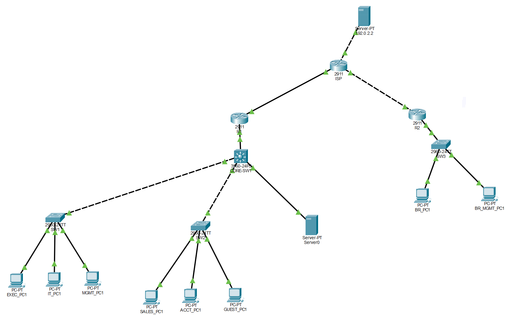

  

# Enterprise Network Infrastructure Lab

The goal of this lab is to design and configure a small enterprise network for a fictional organization using Cisco Packet Tracer. The network is segmented into separate user, server, management, and guest VLANs, with Layer 3 routing and access control used to manage communication between networks.

We will:
- Define the fictional company and its requirements
- Create the physical network topology
- Configure IP address scheme, VLANs and 802.1Q trunking
- Configure inter-VLAN routing
- Configure DHCP and DNS services
- Configure OSPF for dynamic routing
- Configure ACLs to control traffic between VLANs
- Configure basic switch security and SSH management
- Test and troubleshoot network connectivity

## Table of Contents:
- [Design and Initial Config](design_initialConfig.md)
