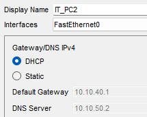
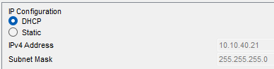
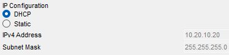
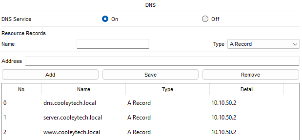
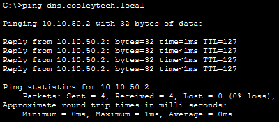

# DHCP and DNS Configuration

Both DHCP and DNS services will be hosted on `MAIN-SERVER`, located at the Main Office.

`MAIN-SERVER` Specifications:
- IP address: `10.10.50.2`
- Default gateway: `10.10.50.1`
- VLAN: `50`

## DHCP Configuration
- Enable the DHCP service in Config page of `MAIN-SERVER`
- Create one DHCP pool for each of the user VLANs
  - VLANs such as `SERVERS` and `NET_MGMT` do not need DHCP pools because I am assigning those devices with static IPs
    <p align="left">
      
    </p>
### DHCP relay
- DHCP clients initially send their DHCP requests as broadcasts.
  - Routers and Layer 3 switches do not normally forward these broadcasts between separate VLANs or subnets.
- The `ip helper-address <IP address>` command configures a Layer 3 interface to forward DHCP requests to the specified DHCP server

### `Core-SW1`
   ```
      CORE-SW1(config)#interface vlan 10
      CORE-SW1(config-if)#ip helper-address 10.10.50.2

      CORE-SW1(config)#interface vlan 20
      CORE-SW1(config-if)#ip helper-address 10.10.50.2

      CORE-SW1(config)#interface vlan 30
      CORE-SW1(config-if)#ip helper-address 10.10.50.2

      CORE-SW1(config)#interface vlan 40
      CORE-SW1(config-if)#ip helper-address 10.10.50.2

      CORE-SW1(config)#interface vlan 70
      CORE-SW1(config-if)#ip helper-address 10.10.50.2
   ```

### `R2`
- The Branch Office is separated from `MAIN-SERVER` by multiple routed networks, so DHCP relay is also required on the Branch User VLAN
    ```
    R2(config)#interface g0/1.110
    R2(config-subif)#ip helper-address 10.10.50.2
    ```

### Verify DHCP:
  - Test DHCP from clients in both the Main and Branch Offices.
  - `IT_PC2` successfully receives an address and DHCP configuration:
      <p align="left">
      
    </p>
        <p align="left">
      
    </p>
  - `BR_PC1` also successfully receives its DHCP configuration:
      <p align="left">
      
    </p>
## DNS Configuration
- Enable the service on `MAIN-SERVER` and add records for any services that should be resolved by network clients
    <p align="left">
      
    </p>

- Confirm DNS resolution:
    <p align="left">
      
    </p>
    
  - Either a `nslookup` or `ping` is sufficient for a simple test, but `nslookup` provides more info about the DNS server


---

**Go to next page: [Security and SSH](security_and_ssh.md)**
