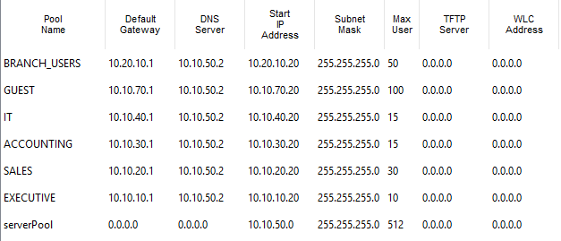

# DHCP and DNS Configuration

Both the DHCP and DNS service will be hosted on `MAIN-SERVER`

`MAIN-SERVER` Specifications:
- IP address: `10.10.50.2`
- Default gateway: `10.10.50.1`
- VLAN: `50`

## DHCP Configuration
- One DHCP pool is created for each of the regular user VLANS
  - VLANs such as `SERVERS` and `NET_MGMT` do not need DHCP pools because devices in those categories traditionally have static IPs

    

      
    

---

**Go to next page: [Security and SSH](security_and_ssh.md)**
