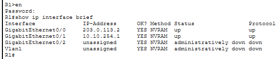

# Network Design and Initial Configuration

## Company Definition
- Company name: Cooley Technologies
- Company size: ~50 employees
- Departments: Management, Sales, Accounting, IT

## Network Design
- The network uses separate address spaces for the Main and Branch Offices:
  - Main Office: `10.10.0.0/16`
  - Branch Office: `10.20.0.0/16`
- Each office is allocated a `/16` address space to allow for further division into department and infrastructure subnets
- Each department/VLAN within an office has a dedicated `/24` address space
  - This gives each department its own L2 broadcast domain while leaving room for additional hosts within each department
- Point-to-point Layer 3 links between routers and Core-SW1 use `/30` subnets, providing 2 usable addresses per link
  - ***Ex:***     R1 `10.10.254.1/30` <----> Core-SW1 `10.10.254.2/30`
- Core-SW1 is a Layer 3 switch that performs inter-VLAN routing for the Main Office using switched virtual interfaces (SVIs).
  - Each SVI serves as the default gateway for its corresponding VLAN
- Interfaces connecting the internal network to the simulated Internet use documentation-reserved addresses ([outlined in RFC 5737](https://www.rfc-editor.org/info/rfc5737/)) rather than real public addresses
- A remote server (`192.0.2.2`) is connected to the ISP router to simulate a host on the public internet

### VLAN Table
| VLAN # |          Name           |     Network    | Core SVI / Gateway |
| :----: | :---------------------: | :------------: | :-----------:      |
| 10     | Executive               | `10.10.10.0/24`  | `10.10.10.1`         |
| 20     | Sales                   | `10.10.20.0/24`  | `10.10.20.1`         |
| 30     | Accounting              | `10.10.30.0/24`  | `10.10.30.1`         |
| 40     | IT                      | `10.10.40.0/24`  | `10.10.40.1`         |
| 50     | Servers                 | `10.10.50.0/24`  | `10.10.50.1`         |
| 60     | Network Management      | `10.10.60.0/24`  | `10.10.60.1`         |
| 70     | Guest                   | `10.10.70.0/24`  | `10.10.70.1`         |
| 110    | Branch Users            | `10.20.10.0/24`  | `10.20.10.1`         |
| 120    | Branch Net. Management  | `10.20.20.0/24`  | `10.20.20.1`         |


### Router and Layer 3 Interface Addressing

|  Device | Interface | Connected Device |     IP Address    |       Subnet      |
| :-----: | :-------: | :--------------- | :---------------: | :---------------: |
|    R1   |    G0/0   | ISP              |  `203.0.113.2/30` |  `203.0.113.0/30` |
|    R1   |    G0/1   | Core-SW1          |  `10.10.254.1/30` |  `10.10.254.0/30`|
| Core-SW1|    G0/1   | R1               |  `10.10.254.2/30` |  `10.10.254.0/30` |
|    R2   |    G0/0   | ISP              | `198.51.100.2/30` | `198.51.100.0/30` |
|    R2   |    G0/1   | SW3              |         —         |       Trunk       |
|   ISP   |    G0/0   | R1               |  `203.0.113.1/30` |  `203.0.113.0/30` |
|   ISP   |    G0/1   | R2               | `198.51.100.1/30` | `198.51.100.0/30` |
|   ISP   |    G0/2   | Internet Server  |   `192.0.2.1/24`  |   `192.0.2.0/24`  |

> **Note:** The R2-to-SW3 connection is an 802.1Q trunk rather than a routed Layer 3 link. R2 uses subinterfaces for VLAN 110 and VLAN 120 to provide inter-VLAN routing at the branch.


## Initial Configuration: 
- Create logical network topology in Cisco Packet Tracer *(refer to network_topology_diagram.png)*
- Set hostname for each device with `hostname [name]`
- Configure IP addresses for each router interface:
  - From Privileged EXEC mode `en`:
    - `show ip interface brief` to see names of all interfaces
  - From Global Config mode `conf t`:
    - ```cisco
      R1(config)#interface [interface name]
      R1(config-if)#ip address [interface IP address] [subnet mask]
      R1(config-if)#no shutdown
      ```
    - Repeat the above step for every connected interface of every router in the topology
- Configure Core-SW1 interface
  - This will convert the uplink interface on Core-SW1 from a L2 switchport to a L3 routed interface
  - From Global Config mode:
    - ```cisco
      CORE-SW1(config)#interface g0/1
      CORE-SW1(config-if)#no switchport 
      CORE-SW1(config-if)#ip address 10.10.254.2 255.255.255.252
      CORE-SW1(config-if)#no shutdown
      ```
- Configure basic router/switch management settings (**on every network device**)
  - Enable password protection
    - `enable secret <password>`
---

This is what R1's interfaces look like by the end of these steps:

<p align="left">
  
</p>

> Notice the password required before entering Privileged EXEC mode

---

## Important Note:
- ### Please save your config after making changes
  - I learned this the hard way :(
  - To write changes: `write memory` or `copy running-config startup-config`
  - To view config: `show running-config` or `show startup-config`

---

**Go to next page: [VLANs and Trunking](vlans_and_trunking.md)**
