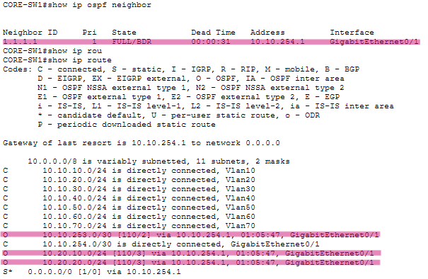
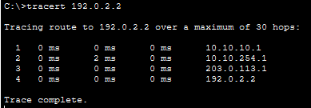

# OSPF and Static Routing Configuration

OSPF (Open Shortest Path First) is a dynamic interior gateway protocol (IGP) used to exchange routing information between routers within a single autonomous system, such as an enterprise network. Unlike static routing, OSPF allows routers to dynamically learn routes to networks that are not directly connected.

Static routes are used to provide default routes toward the simulated internet and to provide the ISP with return routes to the internal networks.

## OSPF Setup
OSPF handles routing between the Main Office and Branch Office and advertises the Main Office networks through Core-SW1/R1

### R1
```
R1(config)#router ospf 1
R1(config-router)#router-id 1.1.1.1
R1(config-router)#network 10.10.254.0 0.0.0.3 area 0
R1(config-router)#network 10.10.253.0 0.0.0.3 area 0
```
### R2
```
R2(config)#router ospf 1
R2(config-router)#router-id 2.2.2.2
R2(config-router)#network 10.20.0.0 0.0.255.255 area 0
R2(config-router)#network 10.10.253.0 0.0.0.3 area 0
```
### Core-SW1
```
CORE-SW1(config)#router ospf 1
CORE-SW1(config-router)#router-id 3.3.3.3
CORE-SW1(config-router)#network 10.10.0.0 0.0.255.255 area 0
CORE-SW1(config-router)#network 10.10.254.0 0.0.0.3 area 0
```

## OSPF Verification
Core-SW1 output shown:
<p align="left">
  
</p>

## Static Routing
Static routes are used to provide default routes toward the simulated internet and to provide the ISP with return routes to the internal networks.

Static route syntax: `ip route [destination network] [subnet mask] [IP address of next hop]`

### R1
- Default route: `ip route 0.0.0.0 0.0.0.0 203.0.113.1`

### Core-SW1
- Default route: `ip route 0.0.0.0 0.0.0.0 10.10.254.1`

### R2
- Default route: `ip route 0.0.0.0 0.0.0.0 198.51.100.1`

### ISP
- Route to Main Office (`R1`): `ip route 10.10.0.0 255.255.0.0 203.0.113.2`
- Route to Branch Office (`R2`): `ip route 10.20.0.0 255.255.0.0 198.51.100.2`

## Testing Routes

### Main Office <-> Simulated Internet
- `R1# ping 192.0.2.2`
  - Successful pings demonstrate working static routes between R1 -> ISP and the direct link to Internet Server

### Branch Office <-> Simulated Internet
- `R2# ping 192.0.2.2`
  - Successful pings demonstrate working static routes between R2 -> ISP and the direct link to Internet Server

### Main Office PC <-> Branch Office PC
- From BR_PC1: `ping 10.10.10.2` (address of EXEC_PC1)
  - Successful pings demonstrate that R2 learned the Main Office network through OSPF and that Core-SW1 can route traffic to R1 using its static default route.

### Trace route from EXEC_PC1 -> Simulated Internet
<p align="left">
  
</p>

- Route path is Core-SW1 -> R1 -> ISP -> Internet Server
- This confirms that the Main Office uses Core-SW1 as its default gateway, forwards external traffic to R1, and then reaches the simulated Internet through the ISP

---

**Go to next page: [DHCP and DNS](dhcp_and_dns.md)**
