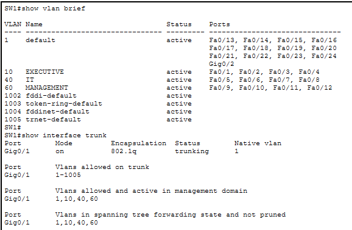
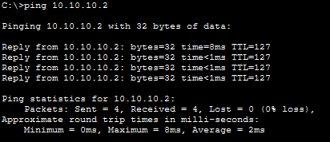

# VLANs and Trunking
Now that the physical topology and initial device configuration are complete, VLANs and trunking can be configured.

| VLAN # |          Name           |     Network    | Core SVI / Gateway |
| :----: | :---------------------: | :------------: | :-----------:      |
| 10     | Executive               | 10.10.10.0/24  | 10.10.10.1         |
| 20     | Sales                   | 10.10.20.0/24  | 10.10.20.1         |
| 30     | Accounting              | 10.10.30.0/24  | 10.10.30.1         |
| 40     | IT                      | 10.10.40.0/24  | 10.10.40.1         |
| 50     | Servers                 | 10.10.50.0/24  | 10.10.50.1         |
| 60     | Network Management      | 10.10.60.0/24  | 10.10.60.1         |
| 70     | Guest                   | 10.10.70.0/24  | 10.10.70.1         |
| 110    | Branch Users            | 10.20.10.0/24  | 10.20.10.1         |
| 120    | Branch Net. Management  | 10.20.20.0/24  | 10.20.20.1         |


## VLAN Configuration
- Core-SW1 needs all Main Office VLANs because it provides inter-VLAN routing for all VLANs in the Main Office
- Access switches only need the specific VLANs that are carried on their ports
  - ***Ex:*** SW1 needs VLANs 10, 40, and 60
- Configure basic VLAN info on each switch:
  - For SW1:
    ```cisco
    SW1(config)# vlan 10
    SW1(config-vlan)# name EXECUTIVE
    SW1(config-vlan)# exit
    SW1(config)# vlan 40
    SW1(config-vlan)# name IT
    SW1(config-vlan)# exit
    SW1(config)# vlan 60
    SW1(config-vlan)# name MANAGEMENT
    SW1(config-vlan)# exit
    SW1(config)# exit
    SW1# write memory
    ```
- Assign ports to VLANs:
  - For SW1:
    - ```cisco
      SW1(config)# interface range fa0/1 - 4
      SW1(config-if-range)# switchport mode access 
      SW1(config-if-range)# switchport access vlan 10
      SW1(config-if-range)# exit
    
      SW1(config)# interface range fa0/5 - 8
      SW1(config-if-range)# switchport mode access 
      SW1(config-if-range)# switchport access vlan 40
      SW1(config-if-range)# exit
    
      SW1(config)# interface range fa0/9 - 12
      SW1(config-if-range)# switchport mode access 
      SW1(config-if-range)# switchport access vlan 60
      ```
  - Here I am assigning ranges of ports (`interface range`) but single ports can be assigned too
  - Repeat the VLAN creation and port assignment steps for each access switch according to the topology

## Trunk Configuration
- Configure trunking for switch-to-switch links:
  - Trunking needs to be configured on both ends of link
  - ```
    SW2(config)# interface g0/1
    SW2(config-if)# switchport mode trunk 
    ```
  - ```
    Core-SW1(config)# interface g0/1
    Core-SW1(config-if)# switchport mode trunk
    ```
- Verify configuration:
  - Use `show vlan brief` to verify VLAN membership and `show interfaces trunk` to verify trunk links
  - Output on SW1:    
    - <p align="left">
        
      </p>

## Inter-VLAN Routing

### Main Office - Core-SW1
- Configure SVIs on Core-SW1:
  - Enable Layer 3 routing on Core-SW1:
    - `CORE-SW1(config)# ip routing`
  - For every VLAN in Main Office:
    ```cisco
    CORE-SW1(config)# interface vlan 10
    CORE-SW1(config-if)# ip address 10.10.10.1 255.255.255.0
    CORE-SW1(config-if)# no shut
    ```
  - Repeat for VLANs 20, 30, 40, 50, 60, and 70.

### Branch Office - R2
- Configure Branch Office subinterfaces:
  - Remove any IP addresses assigned to R2 G0/1 before configuring subinterfaces. The physical interface carries the 802.1Q trunk and the subinterfaces provide the Layer 3 gateways
  - ```
    R2(config)# interface g0/1.110
    R2(config-subif)# encapsulation dot1Q 110
    R2(config-subif)# ip address 10.20.10.1 255.255.255.0
    ```
  - Repeat for VLAN 120
 
## Verify Inter-VLAN Connectivity
  - Since DHCP server has not been configured yet, assign static IP addresses to the 2 test PCs
  - Test connectivity between VLANs within the Main Office:
    - `GUEST_PC1 (10.10.70.2)` → `EXEC_PC1 (10.10.10.2)`
    
    <p align="left">
      
    </p>
    
  - Successful communication confirms that:
    - The PCs are assigned to the correct VLANs
    - The VLANs are carried across the trunk links
    - Core-SW1's SVIs are operational
    - Core-SW1 is performing inter-VLAN routing
